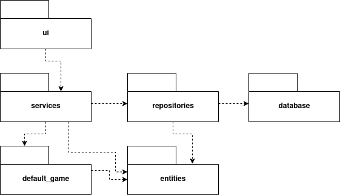
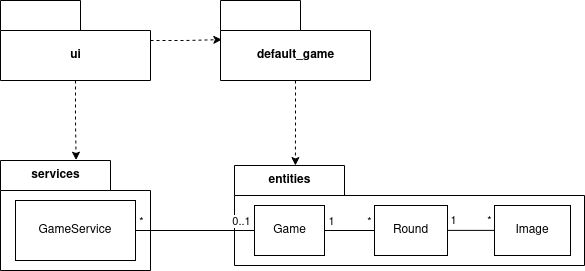
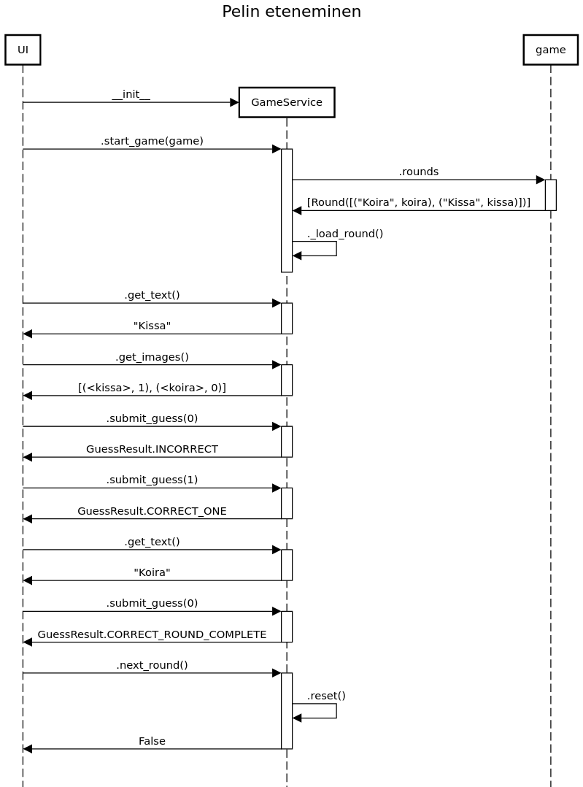
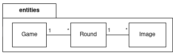

# Arkkitehtuuri

## Rakenne

Sovellus on jaettu kerrosarkkitehtuurin mukaisesti seuraaviin pakkauksiin:

- **ui:** Graafinen käyttöliittymä. Toteutettu tkinter-kirjastolla.
- **services:** Käyttöliittymässä käytettävät palvelut.
- **repositories:** Tietokantaan tallennuksesta huolehtivat luokat.
- **entities:** Sovelluksessa käytettävät tieto-oliot.
- **default_game:** Oletuspelin lataus.
- **database:** Tietokantayhteys. (SQLite)

<!--  -->

## Käyttöliittymä

Käyttöliittymässä on kolme tilaa:

- [Lista/aloitustila](/src/ui/game_list.py)
- [Muokkaustila](/src/ui/game_edit_view.py)
- [Pelitila](/src/ui/game_view.py)

Listanäkymästä voidaan siirtyä joko muokkaamaan tai pelaamaan tiettyä peliä. Tällöin
näkymälle annetaan `Game`-olio, josta data luetaan.

Muokkaustilassa muokataan oliota, ja muutokset tallennetaan tietokantaan vasta, kun
painetaan "Tallenna"-nappia. Muutokset voi siis myös perua. Tallentamisen jälkeen
palataan listatilaan, ja pelit ladataan tietokannasta uudelleen. Kuvia ei kuitenkaan
ladata muistiin uudestaan, jos ne on jo ladattu.

Pelitilassa annetaan `Game`-olio `PlayService`-palvelulle, joka vastaa pelin kulun
logiikasta. Pelitila ei tee muutoksia tietokantaan.

## Pelin eteneminen

Pelilogiikasta on vastuussa `PlayService`-palvelu. (Alla olevassa sekvenssikaaviossa
on sen vanha nimi, `GameService`.)

Jokaisen kierroksen sisällöstä tehdään väliaikaiset kopiot, jotta niiden sisältämien
tekstien ja kuvien järjestys voidaan sekoittaa sattumanvaraiseksi.

Peli etenee siten, että käyttöliittymä kysyy palvelulta, mikä on tällä hetkellä näytettävä
teksti ja kuvajoukko. Kun käyttäjä painaa kuvaa ja tekee arvauksen, kutsutaan palvelun metodia `submit_guess`.
Metodille annetaan kuvan indeksi, joka saatiin `get_images`-metodin paluuarvosta.
Vastaus on jokin `GuessResult`-luettelon alkio, eli joko:

- `INCORRECT`: Väärä vastaus, kierros jatkuu.
- `CORRECT_ONE`: Oikea vastaus, kierros jatkuu.
- `CORRECT_ROUND_COMPLETE`: Oikea vastaus, kierros päättyy.

Käyttöliittymä ei siis tiedä oikeaa vastausta, vaan reagoi palvelun raportoimaan
tulokseen.

Jos kierros jatkuu, riittää kysellä seuraava teksti metodilla `get_text`,
ja mahdollisesti taulukko, joka kertoo, mitkä kuvat on käytetty metodilla `get_used_images`.

Jos tulos on `CORRECT_ROUND_COMPLETE`, tulee kutsua palvelun metodia
`next_round`, jotta siirrytään seuraavaan kierrokseen. Tämän jälkeen kutsutaan jälleen
`get_text` ja `get_images`.

## Pelin muokkaus

Peli koostuu kolmesta eri tieto-oliosta.

- `Game` sisältää monta kierrosta, `Round`.
- `Round` sisältää monta paria tekstiä ja kuvaa, `Image`.
- `Image`

